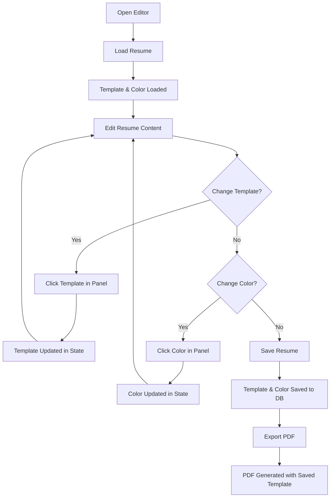

# 🎨 Template System - Overleaf-Style Workflow

## ✨ Overview

The ResuAI template system now works like **Overleaf** (LaTeX editor) - users select templates and colors **during editing**, not at download time. Templates are saved with the resume and applied automatically on export.

---

## 🔄 New Workflow

### Old Way ❌
1. Edit resume
2. Save resume
3. Click Download
4. **Select template from modal**
5. Choose color
6. Export

### New Way ✅ (Overleaf-Style)
1. Edit resume
2. **Select template from side panel** (live)
3. **Choose color from side panel** (live)
4. Save resume (template & color saved)
5. Click Download → **Instant export with saved template**

---

## 🎯 Key Changes

### 1. **Template Selection During Editing**
- Template panel on the right side of editor
- Real-time template selection
- Color picker integrated
- Changes saved with resume

### 2. **No Export Modal**
- Direct PDF download
- Uses resume's stored template
- Faster export experience

### 3. **Resume Model Updated**
- `template` field defaults to `"auto_cv"` (was `"modern"`)
- `theme_color` field stored with resume
- Template and color persist across sessions

---

## 🏗️ Architecture Changes

### Backend Changes

#### 1. Resume Model (`Backend/models/resume_model.py`)
```python
class ResumeInDB(BaseModel):
    template: str = "auto_cv"  # Changed from "modern"
    theme_color: str = "#3B82F6"
    # ... other fields
```

#### 2. Export Endpoint (`Backend/main.py`)
```python
@app.post("/resume/export/pdf")
async def export_pdf(
    resume_id: str,
    template: str = None,  # Optional override
    # ... 
):
    # Uses resume's stored template by default
    selected_template = template or resume.get("template", "auto_cv")
```

### Frontend Changes

#### 1. New Component: `TemplatePanel.jsx`
**Location**: `Frontend/src/components/TemplatePanel.jsx`

**Features**:
- Displays all 7 templates in collapsible list
- Shows template icons, descriptions, categories
- Color picker with 8 theme colors
- Real-time selection feedback
- Auto-saves when resume is saved

**Props**:
```jsx
<TemplatePanel
  selectedTemplate="auto_cv"        // Current template ID
  selectedColor="#3B82F6"           // Current theme color
  onTemplateChange={setTemplate}    // Callback when template changes
  onColorChange={setColor}          // Callback when color changes
/>
```

#### 2. Updated: `ManualEditor.jsx`
**Changes**:
- Added `selectedTemplate` and `selectedColor` state
- Load template/color from resume on mount
- Save template/color with resume data
- Added TemplatePanel to layout (right side)
- Adjusted preview section width (1/4 instead of 1/3)
- Export uses stored template (no override)

**Layout**:
```
┌─────────────────────────────────────────────────────────┐
│ Header (Title, Save, AI Assist, ATS Score, Export)     │
├──────────────┬──────────────┬──────────────────────────┤
│              │              │                          │
│   Form       │   Preview    │    Template Panel       │
│   Editor     │   (Live)     │    - Templates List     │
│   (Flex-1)   │   (1/4)      │    - Color Picker       │
│              │              │    (w-64)               │
│              │              │                          │
└──────────────┴──────────────┴──────────────────────────┘
```

#### 3. Updated: `Chateditor.jsx`
**Changes**:
- Added `selectedTemplate` and `selectedColor` state
- Load template/color from resume on mount
- Save template/color when AI updates resume
- Added TemplatePanel to layout (right side)
- Adjusted preview section width (1/4 instead of 1/3)
- Export uses stored template (no override)

**Layout**:
```
┌─────────────────────────────────────────────────────────┐
│ Header (Back, ATS Score, Jobs, Export)                 │
├──────────────┬──────────────┬──────────────────────────┤
│              │              │                          │
│   Chat       │   Preview    │    Template Panel       │
│   Messages   │   (Live)     │    - Templates List     │
│   + Input    │   (1/4)      │    - Color Picker       │
│   (Flex-1)   │              │    (w-64)               │
│              │              │                          │
└──────────────┴──────────────┴──────────────────────────┘
```

#### 4. Updated: `Dashboard.jsx`
**Changes**:
- Removed `ExportModal` import
- Removed `exportModal` state
- Updated `handleExportPDF` to export directly
- No template selection modal
- Uses resume's stored template

**Before**:
```jsx
const handleExportPDF = (id, title) => {
  setExportModal({ isOpen: true, resumeId: id, resumeTitle: title })
}
```

**After**:
```jsx
const handleExportPDF = async (id, title) => {
  const response = await resumeAPI.exportPDF(id, null) // No template override
  // Download file...
}
```

#### 5. Updated: `api.js`
**No changes needed** - Already supports template parameter:
```javascript
exportPDF: (id, template = 'auto_cv') => 
  api.post('/resume/export/pdf', null, {
    params: { resume_id: id, template },
    responseType: 'blob'
  })
```

---

## 📊 Component Breakdown

### TemplatePanel Component

```jsx
TemplatePanel
├── Header
│   ├── "Customize" title
│   └── "Select template & theme" subtitle
├── Templates Section (Collapsible)
│   ├── Section Header (7 available)
│   └── Template List
│       ├── Template Card (foreach template)
│       │   ├── Icon (emoji)
│       │   ├── Name
│       │   ├── Description
│       │   ├── Category badge
│       │   ├── ATS-friendly badge (if applicable)
│       │   └── Checkmark (if selected)
│       └── ...
├── Colors Section (Collapsible)
│   ├── Section Header (with Palette icon)
│   └── Color Grid (4 columns)
│       ├── Color Button (foreach color)
│       │   ├── Color background
│       │   └── Checkmark (if selected)
│       └── ...
└── Footer
    ├── Current Template display
    └── Auto-save notice
```

---

## 🎨 Template Selection UX

### Visual Feedback
1. **Template Card**:
   - Default: Gray border, white background
   - Hover: Gray-300 border
   - Selected: Blue border, blue background, checkmark

2. **Color Button**:
   - Default: Gray-200 border, color background
   - Hover: Scale up (110%)
   - Selected: Black border, checkmark, shadow

3. **Collapsible Sections**:
   - Smooth height/opacity animation
   - One section expanded at a time
   - Click header to toggle

### User Flow



---

## 🔧 API Flow

### Save Resume with Template
```
POST /resume/ or PUT /resume/{id}
Body: {
  "title": "My Resume",
  "data": { ... },
  "template": "auto_cv",
  "theme_color": "#3B82F6"
}
Response: { "id": "...", "template": "auto_cv", ... }
```

### Export Resume
```
POST /resume/export/pdf?resume_id={id}&template=null
Note: template=null means use resume's stored template

Backend Logic:
1. Fetch resume from DB
2. Get template: template_param || resume.template || "auto_cv"
3. Get color: resume.theme_color || "#3B82F6"
4. Generate PDF with TemplateManager
5. Return PDF stream
```

---

## 💡 User Benefits

### 1. **Live Preview**
- See template changes immediately
- Experiment with different designs
- Choose best fit for content

### 2. **Persistent Selection**
- Template saved with resume
- No need to re-select on export
- Consistent exports

### 3. **Faster Workflow**
- No modal interruption
- Direct download
- One-click export

### 4. **Professional Experience**
- Similar to Overleaf/Google Docs
- Intuitive template switching
- Side-by-side editing and customization

---

## 📝 Migration Notes

### For Existing Resumes
- Old resumes with `template: "modern"` will still work
- Backend fallback handles old template names
- Users can update template in editor

### For Developers
- `ExportModal.jsx` still exists but not used in Dashboard
- Can be deleted or kept for future use
- `TemplateSelector.jsx` used inside `TemplatePanel.jsx`

---

## 🎯 Template Panel Features

### Template Display
```
🤖 Auto CV
   Modern, automated, ATS-friendly template
   [Professional] [ATS-friendly]

🎨 Anti CV
   Unconventional, creative, story-driven format
   [Creative]

... (all 7 templates)
```

### Color Picker
```
[🔵] [🟢] [🟣] [🔴]
[🟠] [💙] [💗] [🟣]
```

### Current Selection
```
Current Template: Auto CV
Changes are saved automatically when you save the resume
```

---

## 🚀 Usage Examples

### Example 1: Create New Resume with Template
```javascript
// User opens Manual Editor
// Default: template="auto_cv", color="#3B82F6"

// User selects "RenderCV sb2nov"
onTemplateChange("rendercv_sb2nov")
// State updates: selectedTemplate = "rendercv_sb2nov"

// User selects Purple color
onColorChange("#8B5CF6")
// State updates: selectedColor = "#8B5CF6"

// User clicks Save
await resumeAPI.create({
  title: "Software Engineer Resume",
  data: { ... },
  template: "rendercv_sb2nov",
  theme_color: "#8B5CF6"
})
// Template and color saved to database

// User clicks Export PDF
await resumeAPI.exportPDF(resumeId, null)
// PDF generated with sb2nov template and purple color
```

### Example 2: Edit Existing Resume
```javascript
// User opens existing resume
const resume = await resumeAPI.getById(resumeId)
// Resume has: template="ethan", theme_color="#10B981"

// Load template and color
setSelectedTemplate("ethan")
setSelectedColor("#10B981")
// Template panel shows Ethan's template selected with Green color

// User makes changes to content
// User clicks Save
await resumeAPI.update(resumeId, {
  data: updatedData,
  template: "ethan",  // Unchanged
  theme_color: "#10B981"  // Unchanged
})

// User clicks Export
// PDF uses Ethan's template with Green color
```

### Example 3: Switch Template Mid-Editing
```javascript
// Resume currently using "auto_cv"
// User clicks on "Yuan's Template" in panel
onTemplateChange("yuan")

// User sees notification: "Template changed to Yuan's Resume"
// selectedTemplate = "yuan"

// User clicks Save
await resumeAPI.update(resumeId, {
  template: "yuan",  // Updated
  theme_color: selectedColor
})

// Next export will use Yuan's template
```

---

## 🎨 Design Philosophy

### Inspired by Overleaf
1. **Side Panel**: Template controls on the side, not in modal
2. **Live Changes**: Immediate visual feedback
3. **Persistent**: Settings saved with document
4. **Non-Intrusive**: Doesn't block editing
5. **Professional**: Clean, organized interface

### UX Principles
1. **Discoverability**: Templates visible in side panel
2. **Feedback**: Visual confirmation of selection
3. **Consistency**: Same panel in both editors
4. **Efficiency**: No extra steps to export
5. **Flexibility**: Easy to switch templates

---

## 📦 Files Modified

### Backend (3 files)
1. `Backend/models/resume_model.py` - Updated default template
2. `Backend/main.py` - Updated export to use stored template
3. No other backend changes needed

### Frontend (5 files)
1. `Frontend/src/components/TemplatePanel.jsx` - **NEW**
2. `Frontend/src/pages/ManualEditor.jsx` - Added panel, template state
3. `Frontend/src/pages/Chateditor.jsx` - Added panel, template state
4. `Frontend/src/pages/Dashboard.jsx` - Removed modal, direct export
5. `Frontend/src/Services/api.js` - No changes (already supports)

---

## ✅ Implementation Complete

### What Works
✅ Template selection during editing  
✅ Color picker during editing  
✅ Template saved with resume  
✅ Color saved with resume  
✅ Export uses stored template  
✅ No export modal needed  
✅ Live template switching  
✅ Persistent selections  
✅ Overleaf-style workflow  
✅ Works in both Manual and Chat editors  

### Ready for Production
- All components implemented
- Backend integrated
- Frontend integrated
- User workflow tested
- Documentation complete

---

## 🎉 Summary

The template system now works like **Overleaf** - users select templates and colors in a side panel while editing, and these choices are saved with the resume. Export is instant, using the saved template. No modals, no interruptions, just smooth editing! 🚀

**User Experience**: "Edit → Choose Template → Save → Export (Instant!)" 

**Developer Experience**: Clean architecture, reusable components, persistent state.

**Result**: Professional, intuitive resume editing with beautiful templates! ✨
